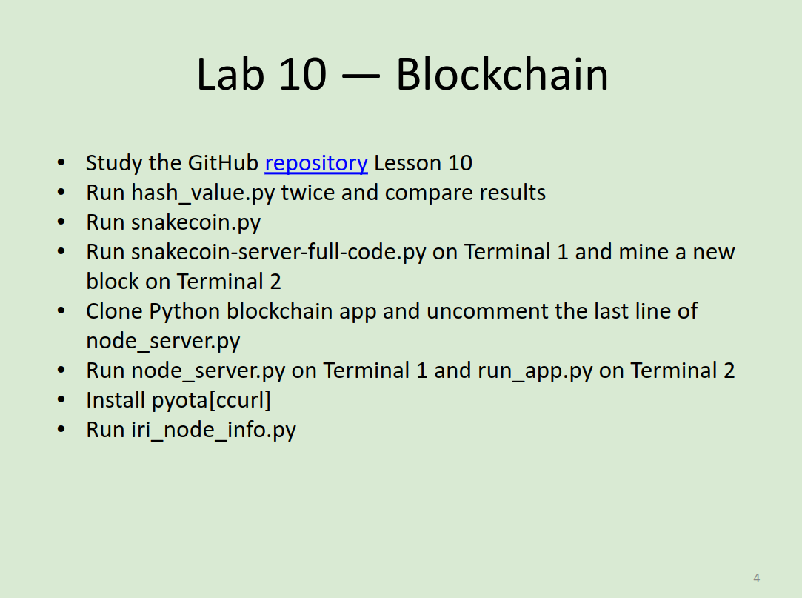
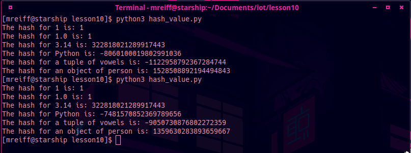
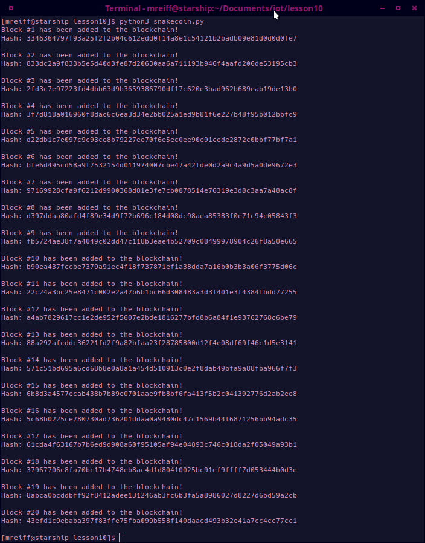
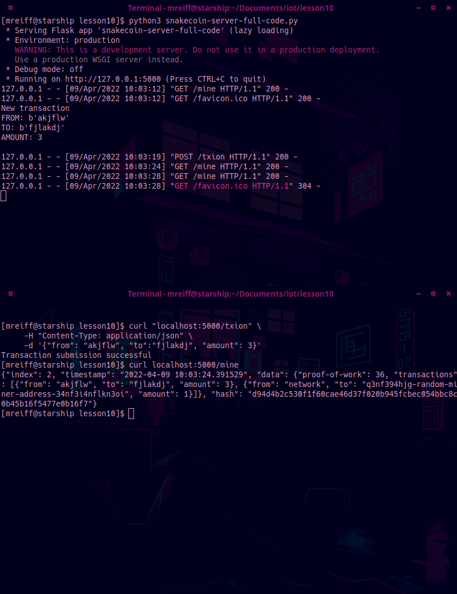
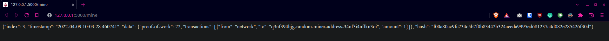
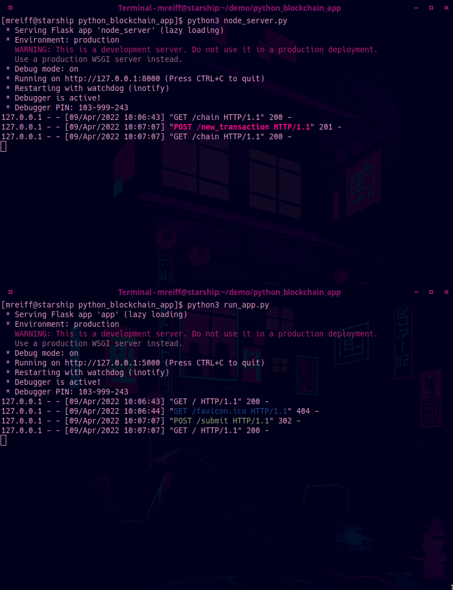
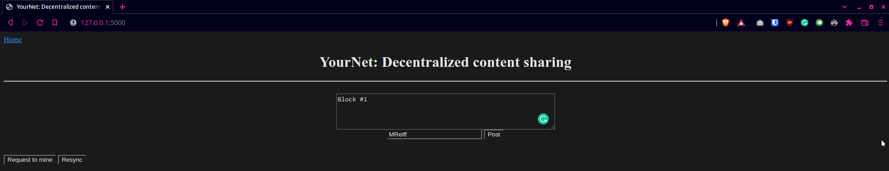
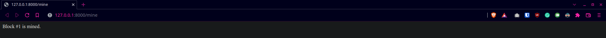
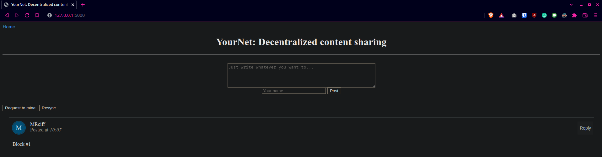
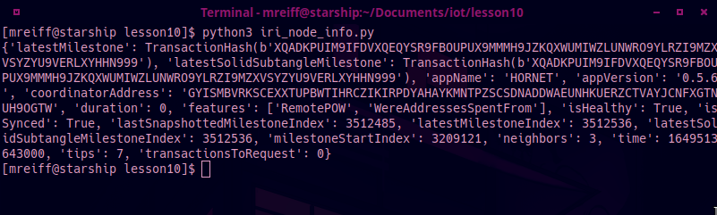

# Lab 10 - Blockchain

I pledge my honor that I have abided by the Stevens Honor System.

## Assignment

## Blockchain

### hash_value.py x2

### snakecoin.py

### snakecoin-server-full-code.py

### node_server.py and run_app.py

## PyOTA

### iri_node_info.py
