# Lab 3 - Python
I pledge my honor that I have abided by the Stevens Honor System.
I am performing these actions on my own local machine and not the Raspberry Pi.

## Assignment
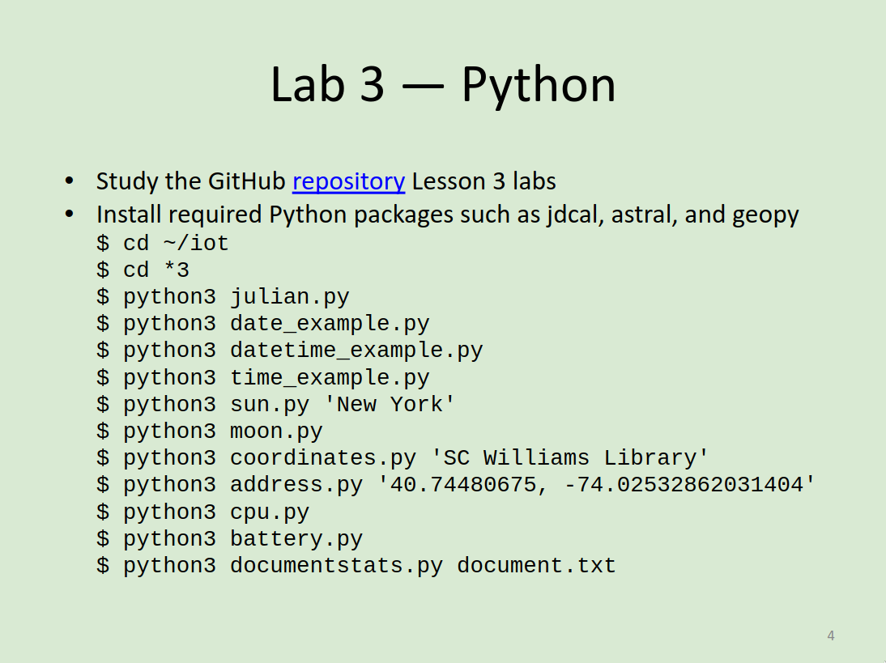

### cd
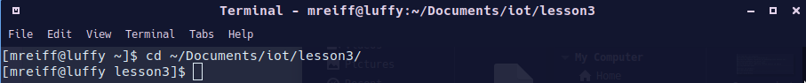

### julian
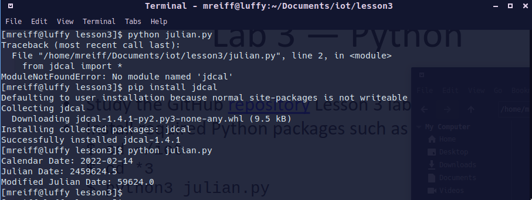

### date_example
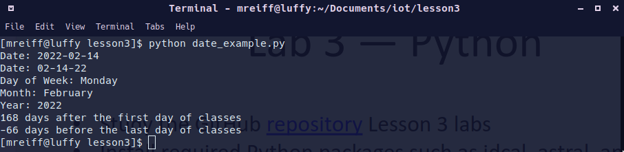

### datetime_example
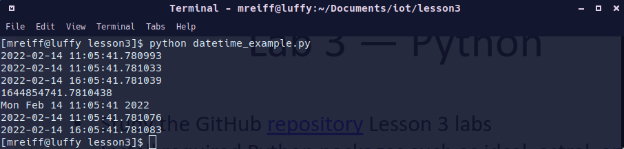

### time_example
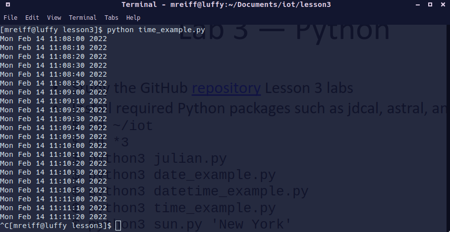

### sun
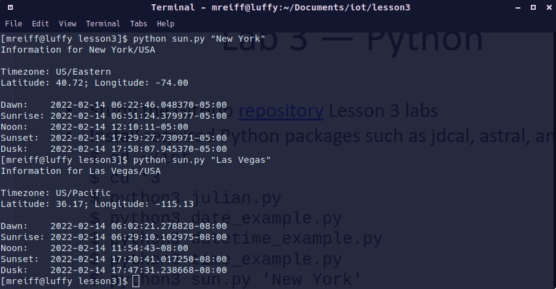

### moon
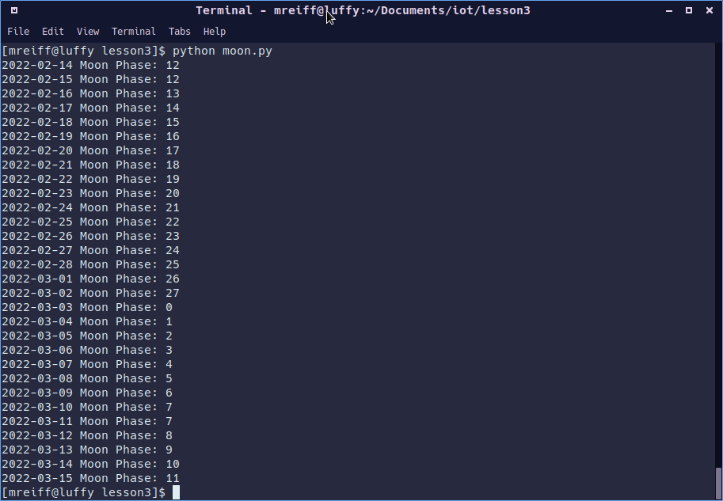

### coordinates
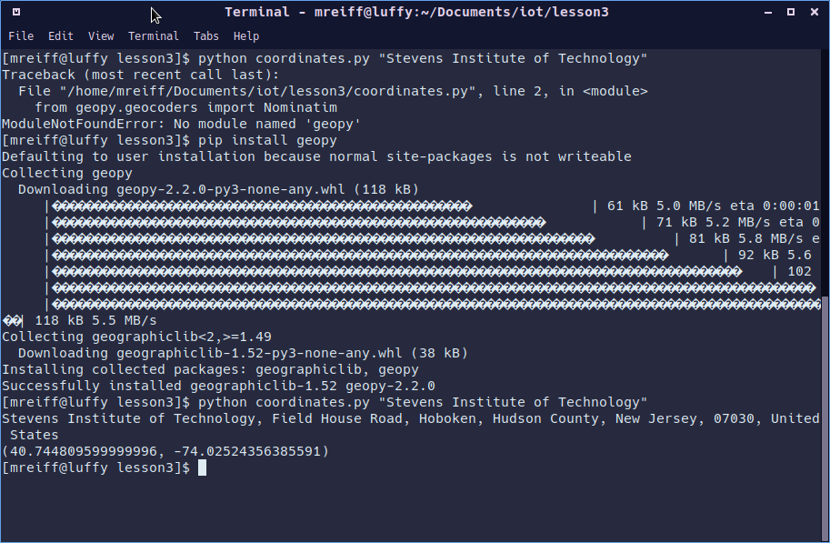

### address
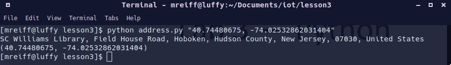

### cpu
On my host machine
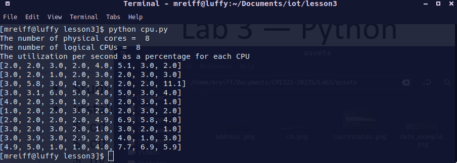

On my Raspberry Pi
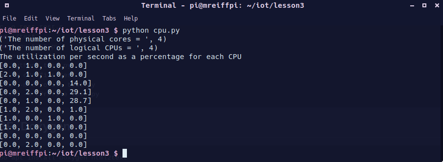

### battery
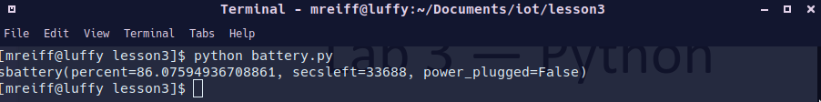

### documentstats
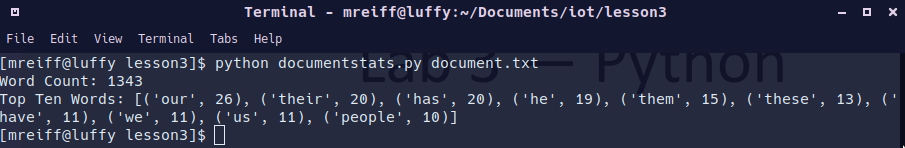

## Other
As a basic exercise, I decided to write a [Python script](systemInfo.py) that displays some basic system information including stats about the CPU system memory, SWAP, disk, and battery. I based this of the [cpu.py](https://github.com/kevinwlu/iot/blob/master/lesson3/cpu.py) example from the class repository utilizing [psutil](https://pypi.org/project/psutil/).

On my laptop
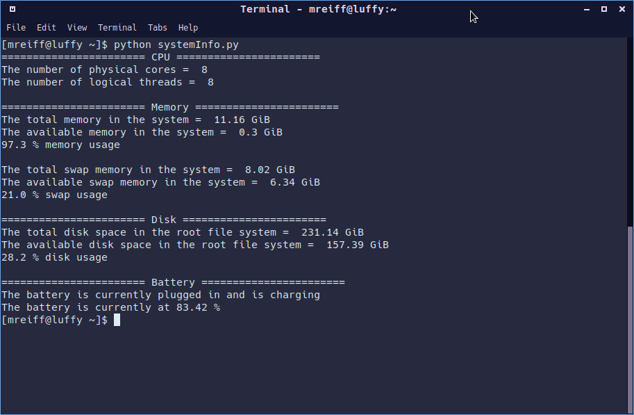

On my desktop
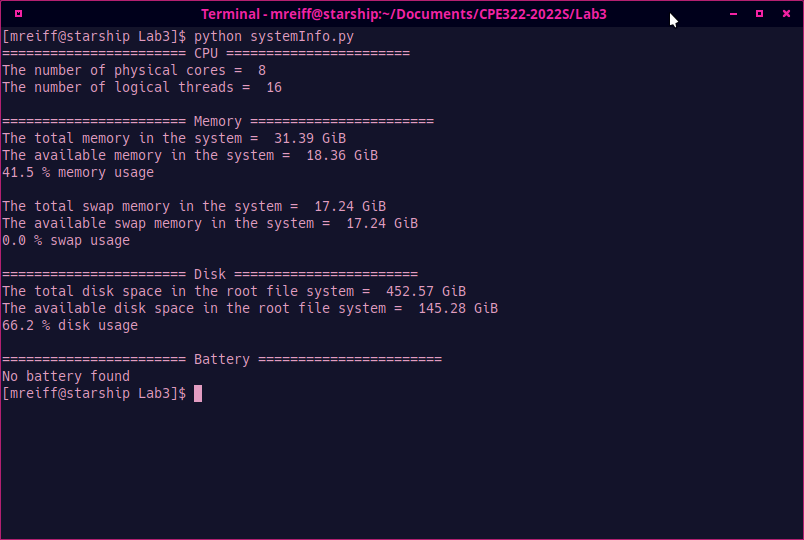

On my Raspberry Pi
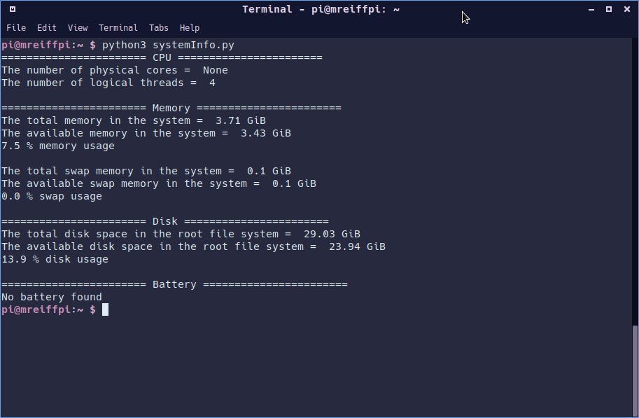
Despite SWAP being enabled and functional on the Pi, the stats reported using `psutil` regarding the current SWAP usage are incorrect and do not match what is reported by `htop` or `free -h`. This might be due to how little SWAP space is allocated on the Pi (100 MiB) compared to my desktop (17 GiB) or laptop (8 GiB).