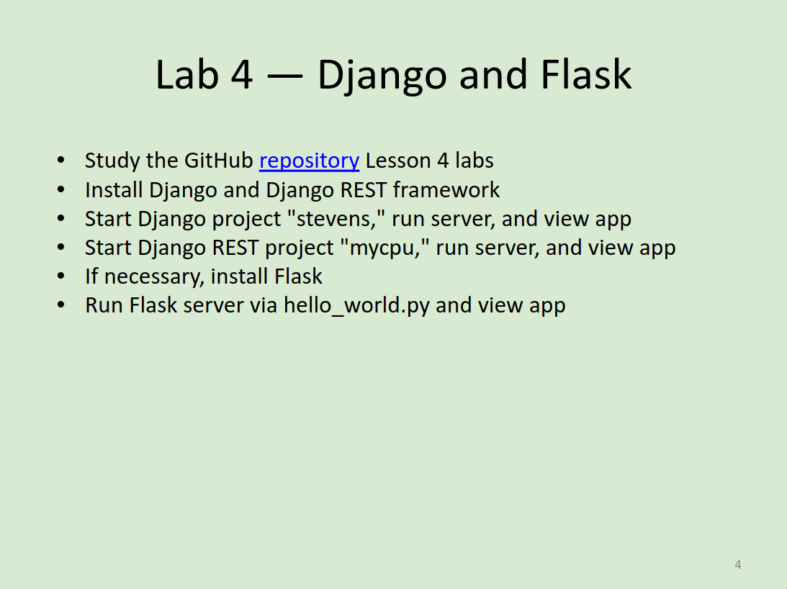
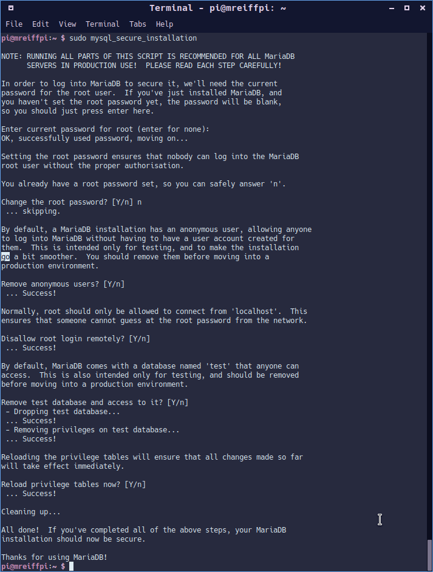
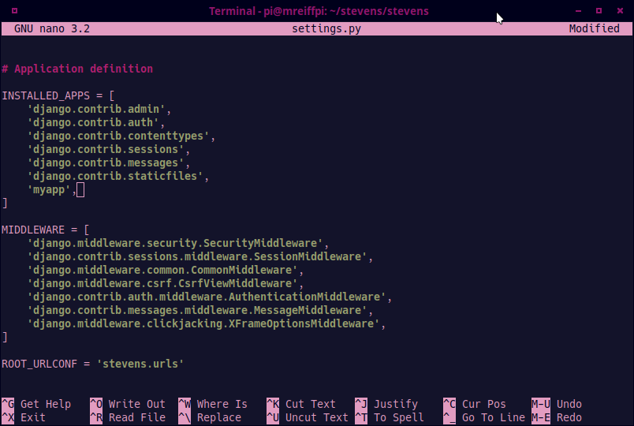
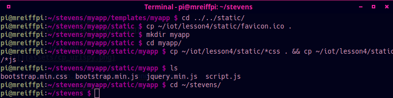

# Lab 4 - Django and Flask

I pledge my honor that I have abided by the Stevens Honor System.

## Assignment



## Install Django and Django REST framework on Raspberry Pi

### pip3 -V


### pip3 list

```sh
pi@mreiffpi:~ $ pip3 list
Package           Version    
----------------- -----------
asn1crypto        0.24.0     
astral            2.2        
astroid           2.1.0      
asttokens         1.1.13     
automationhat     0.2.0      
beautifulsoup4    4.7.1      
blinker           1.4        
blinkt            0.1.2      
buttonshim        0.0.2      
Cap1xxx           0.1.3      
certifi           2018.8.24  
chardet           3.0.4      
Click             7.0        
colorama          0.3.7      
colorzero         1.1        
cookies           2.2.1      
cryptography      2.6.1      
cupshelpers       1.0        
docutils          0.14       
drumhat           0.1.0      
entrypoints       0.3        
envirophat        1.0.0      
ExplorerHAT       0.4.2      
Flask             1.0.2      
fourletterphat    0.1.0      
gpiozero          1.6.2      
html5lib          1.0.1      
idna              2.6        
isort             4.3.4      
itsdangerous      0.24       
jedi              0.13.2     
Jinja2            2.10       
keyring           17.1.1     
keyrings.alt      3.1.1      
lazy-object-proxy 1.3.1      
logilab-common    1.4.2      
lxml              4.3.2      
MarkupSafe        1.1.0      
mccabe            0.6.1      
microdotphat      0.2.1      
mote              0.0.4      
motephat          0.0.3      
mypy              0.670      
mypy-extensions   0.4.1      
numpy             1.16.2     
oauthlib          2.1.0      
olefile           0.46       
pantilthat        0.0.7      
parso             0.3.1      
pexpect           4.6.0      
pgzero            1.2        
phatbeat          0.1.1      
pianohat          0.1.0      
picamera          1.13       
piglow            1.2.5      
pigpio            1.78       
Pillow            5.4.1      
pip               18.1       
psutil            5.5.1      
pycairo           1.16.2     
pycrypto          2.6.1      
pycups            1.9.73     
pygame            1.9.4.post1
Pygments          2.3.1      
PyGObject         3.30.4     
pyinotify         0.9.6      
PyJWT             1.7.0      
pylint            2.2.2      
pyOpenSSL         19.0.0     
pyserial          3.4        
pysmbc            1.0.15.6   
python-apt        1.8.4.3    
pytz              2021.3     
pyxdg             0.25       
rainbowhat        0.1.0      
reportlab         3.5.13     
requests          2.21.0     
requests-oauthlib 1.0.0      
responses         0.9.0      
roman             2.0.0      
RPi.GPIO          0.7.0      
RTIMULib          7.2.1      
scrollphat        0.0.7      
scrollphathd      1.2.1      
SecretStorage     2.3.1      
Send2Trash        1.5.0      
sense-hat         2.2.0      
setuptools        40.8.0     
simplejson        3.16.0     
six               1.12.0     
skywriter         0.0.7      
sn3218            1.2.7      
soupsieve         1.8        
spidev            3.5        
ssh-import-id     5.7        
thonny            3.3.10     
touchphat         0.0.1      
twython           3.7.0      
typed-ast         1.3.1      
unicornhathd      0.0.4      
urllib3           1.24.1     
webencodings      0.5.1      
Werkzeug          0.14.1     
wheel             0.32.3     
wrapt             1.10.11
```

### pip3 install -U

Not going to show this as the output is extreamly long.

## Install MariaDB server and client on Raspberry Pi

### apt update (and upgrade)


### apt install

Not going to show this as the output is extreamly long.

### pip3 install


### mysql_secure_installation



## Start Django project "stevens"

### Start a Django project & Django app


### Create MySQL database


### Edit settings.py



### Copy urls.py


### Copy admin.py, models.py, and views.py


### Copy index.html


### Edit index.html to add the Google Maps API key


### Copy static files



### Migrate and create superuser


### Run Django server


### Accessing Django


## Start Django REST project "mycpu"

### Start a Django project & Django app


### Edit settings.py


### Copy urls.py


### Copy admin.py, models.py, views.py, and serializers.py


### Copy index.html


### Edit index.html to add the Google Maps API key


### Copy static files


### Copy controller.py


### Migrate and create superuser


### Run Django server


### Accessing Django


## Install Flask and run hello_world.py

### Run Flask server


### Accessing Flask
