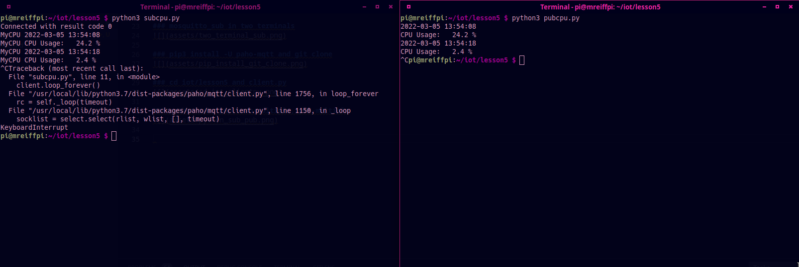
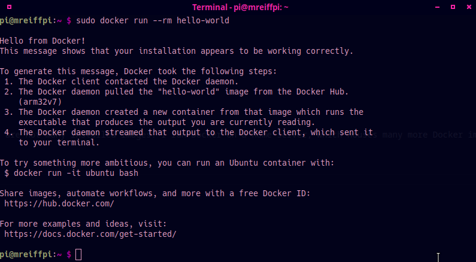

# Lab 5 - Paho-MQTT

I pledge my honor that I have abided by the Stevens Honor System.

## Assignment

## Eclipse Mosquitto and Eclipse Paho

### apt install mosquitto mosquitto-clients

### mosquitto_sub -h localhost -v -t "\$SYS/#"

### service mosquitto status

### netstat -tln

### mosquitto_sub in two terminals

### pip3 install -U paho-mqtt and git clone

### cd iot/lesson5 and client.py

### python sub, pup, sub-multiple, pub-multiple

### python subcpu and pubcpu

### subraspi and pubraspi

## Crossbar.io

### docker version

### docker images

As the Raspberry Pi has not been used for Docker prior, there are not many installed images. I run Docker on a home server, which houses many more Docker images and containers.

### docker run hello-world

### docker run ubuntu

### git clone and tree

### docker pull and docker run crossbar

### crossbar info in browser

### cd crossbar and cat config.json

### run publish-client and subscribe-client
