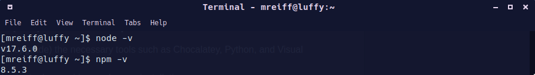

# Lab 6 - Node.js and Pystache

I pledge my honor that I have abided by the Stevens Honor System.

## Assignment

## Node.js
Programming using Node.js is one of my favorite ways to make basic programs and automation scripts.

### node -v and npm -v

### node hello-world.js

### node hello.js

### node http.js

## Pystache

## Optional
As mentioned on the Lesson 6 GitHub page, Particle Cloude does not work on Raspberry Pi 4Bs, so I am not able to do this portion of the assignment.

In exchange for the time saved by not being able to complete this part of the assignment, I will take some time to write about my experince with Node.js.

I started to learn how to program using Node.js in 10th grade, when I set out with the goal of making a Discord bot using [`discord.js`](https://github.com/discordjs/discord.js), an npm package for interfacing with Discord's API. I worked on this project, called [M8 Bot](https://github.com/MAPReiff/M8-Bot) until midway through 2019, when I handed the project over to a friend so I would have more time to focus on starting college later that year. While working on the project, I learned alot about JavaScript, Node.js, JSON, REST APIs, as well as how to manage a project. This project was ultimately abandoned a few months after I handed it over, but the learning experince was fantastic.

In addition to that large project, I have also published two npm packages. The first was [`weather-js2`](https://www.npmjs.com/package/weather-js2), which was a modificaton of the [`weather-js`](https://www.npmjs.com/package/weather-js) package. The user is able to enter a location and the package will return data about the weather at that location in JSON format.

The second package was [`steam-searcher`](https://www.npmjs.com/package/steam-searcher), a package which searched the Steam catalog for items sold on the Steam platform, such as video games, DLC, and videos. This package was made from a personal need (for the previously mentioned Discord bot), as at the time nobody had created such a package. The user is able to enter a search term, and the package will return information about the results in JSON format.
