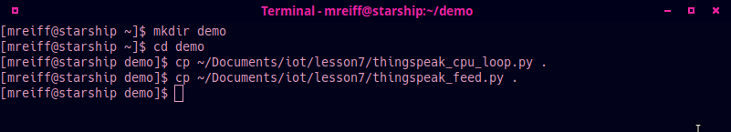
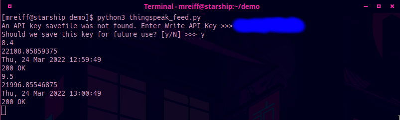
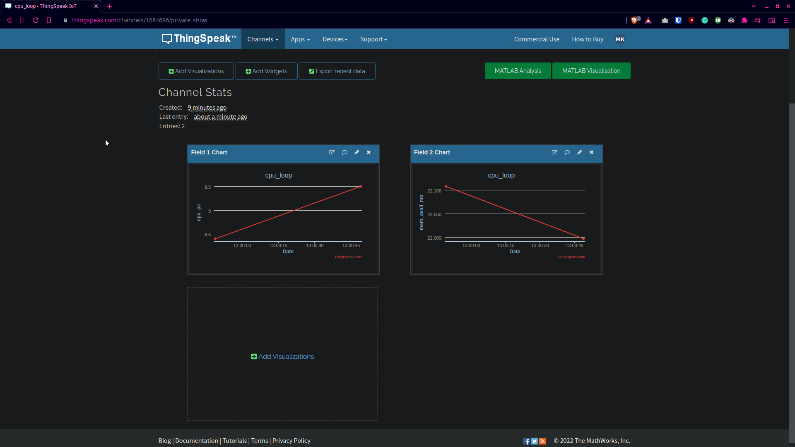
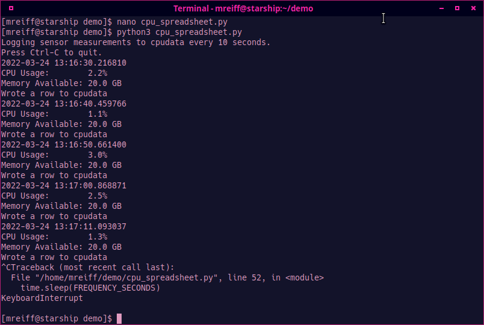
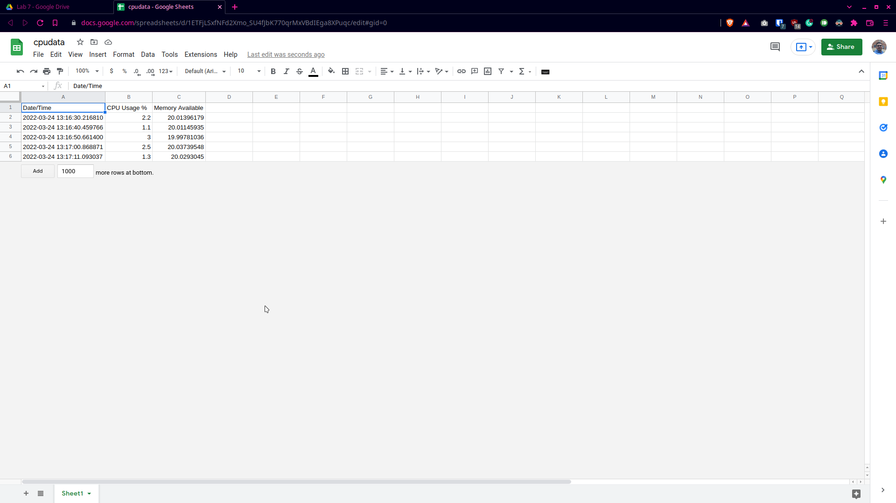

# Lab 7 - ThingSpeak and Google Sheets

I pledge my honor that I have abided by the Stevens Honor SYstem.

## Assignment


## ThingSpeak

### Copy files to demo directory


### Run thingspeak_feed.py




## Google Sheets

### Copy files to demo directory


### Run cpu_spreadsheet.py
As I am doing this assignment on my PC and not a Raspberry Pi, I am using the `cpu_spreadsheet.py` script rather than the `rpi_spreadsheet.py` script.





## Extra

In the instructions for the Google Sheets part of the lab, it says that we need to delete rows 2 - 1000 before we start the script as it is designed to append data to the sheet, rather than check for the next empty row. I have mad modifications to [cpu_spreadsheet.py](./cpu_spreadsheet.py) to account for this.

To do this, I implemented two functions. The first is based on one that I found on a [Stack Overlow post](https://stackoverflow.com/questions/40781295/how-to-find-the-first-empty-row-of-a-google-spread-sheet-using-python-gspread/42476314#42476314) which helps me find the last row of the sheet that was filled in. The second is one that finds the total number of rows in the sheet.
```py
def find_previous_row(worksheet):
  str_list = list(filter(None, worksheet.col_values(1)))
  return len(str_list)

def find_max_rows(worksheet):
  return len(worksheet.get_all_values())
```

With a simple if statement, it is possible to check if the last used row is also the last row of the sheet. It it is, a new row is appended, and if not the next  open row is used.
```py
previous_row = find_previous_row(worksheet)
max_rows = find_max_rows(worksheet)
        
if previous_row < max_rows:
  worksheet.update_acell("A{}".format(previous_row), str(dat))
  worksheet.update_acell("B{}".format(previous_row), cpu)
  worksheet.update_acell("C{}".format(previous_row), mem)
else:
  worksheet.append_row((str(dat), cpu, mem))
```

With these modifications, the need to delete all of the empty pre generated rows is alleviated, while accounting for a user running out of rows! I have also made this modification to the  script.