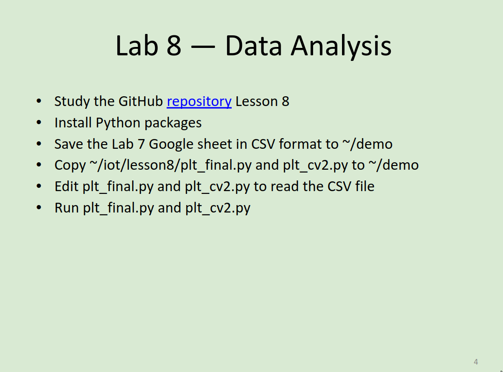
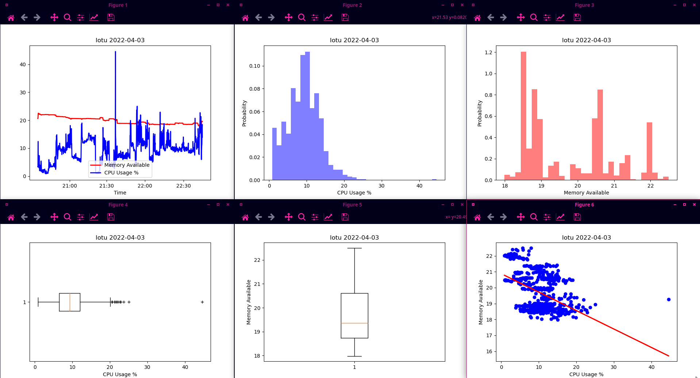
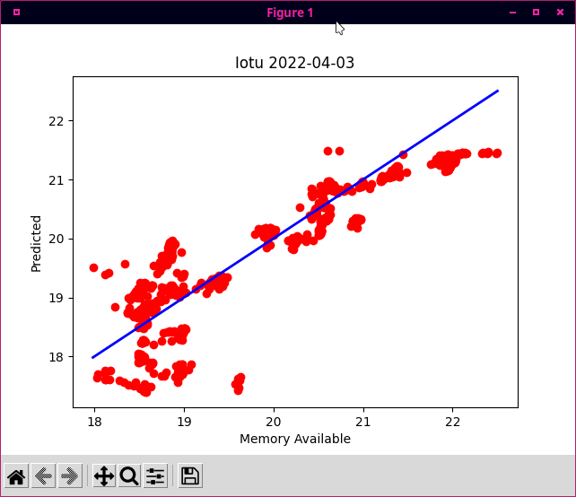

# Lab 8 - Data Analysis

I pledge my honor that I have abided by the Stevens Honor System.

## Assignment

## Data Analysis

### plt_final.py

### plt_cv2.py

In order to get `plt_cv2.py` to work, I had to specifcally use Python 3.7, rather than 3.10 which is the default when using `python3`.

The data was collected over ~4 hours, which consisted of me using my computer to do homework, watch videos from YouTube and Plex, as well as some idle time while I was away from the machine. There was a point during the collection period when I was updating my system using my package manager, which included compiling a package from source. Thus, there is one data point where the CPU ussage spiked higher than the rest (to 44.6%). System memory availability stayed mostly consistant near 20GiB, sometimes dropping down to 19 or 18.5 if I opened a new window or going up to 21 if I closed a window.

The [spreadsheet](assets/cpudata.csv) can be found in the `assets` subdirectory.